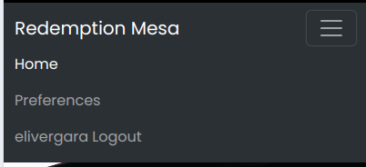

# Redemption Mesa

## Overview
**Redemption Mesa** is a Progressive Web Application (PWA) built with Django 5 to support a local church's community engagement. Designed with mobile users in mind, the app offers a seamless experience for managing church events, accessing sermon resources, and engaging with church updates. The app allows for easy navigation, user-friendly forms, and distinct user roles for administrators and regular users.

The app is hosted on a VPS server and is accessible at [redemption-mesa.site](https://redemption-mesa.site). As a PWA, it can be installed on Android and iOS devices for quick access.

## Features

### Homepage
- **Hero Section**: Displays a welcoming banner with a hero photo and links to navigate to key sections of the app. 
  - 

### Navigation Bar
- Dynamic navbar adjusts based on user login status:
  - **Logged-out users**: Links to "Home," "Register," and "Login."
    - 
  - **Logged-in users**: Displays additional options for "Preferences" and other relevant sections.
    - 

### User Management
- **Registration**: New users can register with a simple form.
  - 
- **Login**: Registered users can log in to access personalized features.
  - 
- **Preferences**: Logged-in users can manage subscriptions for church updates, change their passwords, or export subscribed emails (staff-only feature).
  - 

### Events Management
- **Public Access**: All users can view events.
- **Staff Privileges**: Staff users can add, edit, or delete events.
  - 

### Watch Section
- Embedded YouTube videos of worship services and other church content.
- Staff users can add new videos via an embed link form.
  - 
  - 

### About Us
- Provides information about the church and a link to its physical location.
  - 

### Notes Section
- **Public Access**: Users can view posts related to sermons or other updates.
- **Staff Features**: Staff users can add notes (posts) using a form.

### Give Section
- Redirects users to the church's Pushpay page for tithes and offerings.

## Technical Details
- **Framework**: Django 5 with templating for dynamic content rendering.
- **Frontend**:
  - **Design**: Utilizes Bootstrap (via CDN) for a responsive and visually appealing layout.
  - **Icons**: Font Awesome icons.
  - **Customizations**: Additional styling with custom CSS.
- **Backend**:
  - Dynamic routing and content rendering through Django views.
  - Distinction between user roles (e.g., staff and regular users).
- **Progressive Web App**:
  - Offline capabilities and installable on mobile devices.
  - Ensures accessibility and quick loading times.

## Development
This app was designed and developed by **Eli Vergara**, utilizing a blend of backend development in Django and frontend design using Bootstrap and CSS. Minimal JavaScript was included for enhanced interactivity.

## Installation
1. Clone the repository:
   ```bash
   git clone https://github.com/username/redemption-mesa.git
   ```
2. Navigate to the project directory:
   ```bash
   cd redemption-mesa
   ```
3. Set up a virtual environment and install dependencies:
   ```bash
   python -m venv env
   source env/bin/activate  # On Windows: env\Scripts\activate
   pip install -r requirements.txt
   ```
4. Set up the database:
   ```bash
   python manage.py migrate
   ```
5. Run the development server:
   ```bash
   python manage.py runserver
   ```
6. Access the app at `http://127.0.0.1:8000/`.

## Hosting
The app is hosted on a VPS server, configured with OpenLiteSpeed and Ubuntu 24.04. 

## Screenshots
All referenced screenshots are stored in the `screenshots` directory and will be added to the GitHub repository.

## Future Plans
- Add real-time chat functionality for church members.
- Enhance PWA capabilities for a better offline experience.
- Implement analytics for staff to track user engagement.

## Acknowledgments
Special thanks to the Redemption Mesa Church for providing the opportunity to develop this app to serve the community better.

